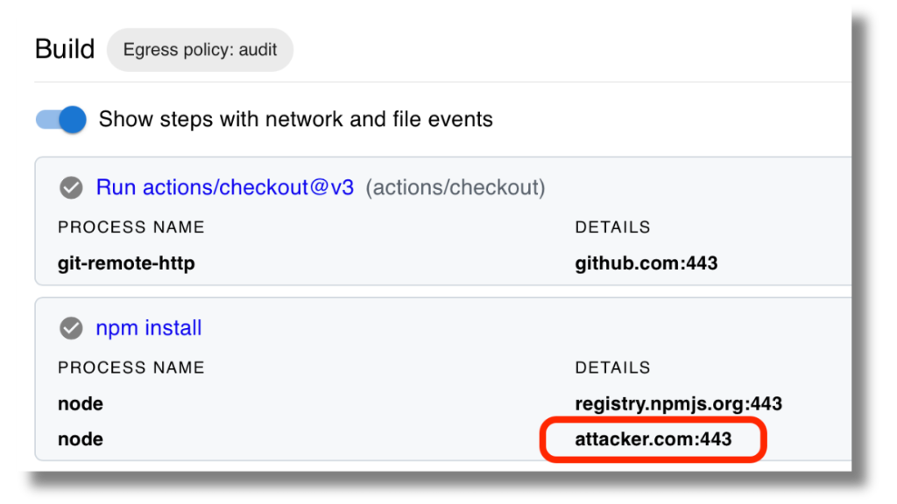
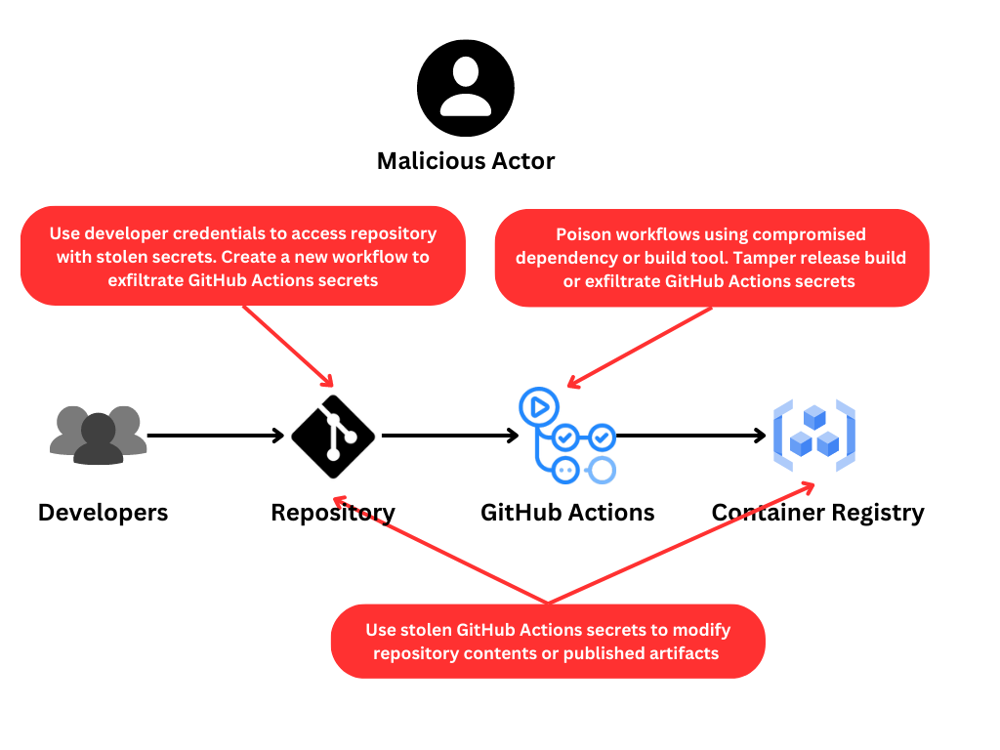
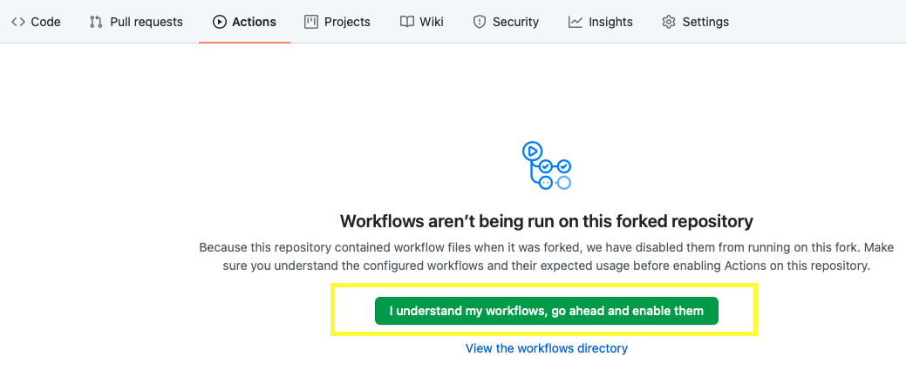

# GitHub Actions Goat: Deliberately Vulnerable GitHub Actions CI/CD Environment

GitHub Actions Goat by [StepSecurity](https://stepsecurity.io) is an educational project that simulates common security attacks and vulnerabilities in a GitHub Actions CI/CD environment and shows how to defend against such attacks.

The importance of CI/CD Security has been underlined by guidance from the Cybersecurity & Infrastructure Security Agency (CISA) and the National Security Agency (NSA). As per their document [Defending Continuous Integration/Continuous Delivery (CI/CD) Environments](https://media.defense.gov/2023/Jun/28/2003249466/-1/-1/0/CSI_DEFENDING_CI_CD_ENVIRONMENTS.PDF):

> CI/CD environments have become attractive targets for malicious cyber actors (MCAs) aiming to introduce malicious code, steal intellectual property, or cause denial of service attacks against applications.

The increasing number of attacks on CI/CD environments, such as the infamous SolarWinds, Codecov, and ua-parser-js attacks, paints a vivid picture of this growing threat.

GitHub Actions Goat incorporates best practices from the [CISA/ NSA guidance on CI/CD Security](https://media.defense.gov/2023/Jun/28/2003249466/-1/-1/0/CSI_DEFENDING_CI_CD_ENVIRONMENTS.PDF) and the [GitHub's Security Hardening for GitHub Actions guide](https://docs.github.com/en/actions/security-guides/security-hardening-for-github-actions) to showcase how these threats can be mitigated in **GitHub Actions Hosted-Runners** and self-hosted **Actions Runner Controller (ARC)** environments.

## Puzzle Time

Lets kick things off with a challenge designed to get your analytical gears turning:

- Take a look at the [publish.yml](.github/workflows/publish.yml) GitHub Actions workflow.
- This workflow uses the [Harden-Runner GitHub Action](https://github.com/step-security/harden-runner), which provides Security Observability and Runtime Enforcement for GitHub Actions workflows.
- Now, we present you with the puzzle. Check out these [network events monitored during a workflow run](https://app.stepsecurity.io/github/step-security/github-actions-goat/actions/runs/6292618211) of this workflow. Notice anything odd?

**Why is there an outbound call to `attacker.com` during the workflow run?** Is this expected, or something more nefarious?

> For the answer of the puzzle, check out the first hands-on tutorial on [Filtering Egress Network Traffic](./docs/Solutions/RestrictOutboundTraffic.md) from a GitHub Actions workflow run.

 

## Threat Scenarios

The [CISA/ NSA guidance on CI/CD Security](https://media.defense.gov/2023/Jun/28/2003249466/-1/-1/0/CSI_DEFENDING_CI_CD_ENVIRONMENTS.PDF) covers 3 main threat scenarios.

### 1. Attacker acquires a developer's credential to access a Git repository

In a GitHub Actions CI/CD environment, someone with write access to a repository can create a new GitHub Actions workflow in a new branch. This workflow which will run in a new branch, which does not have branch protection rules and has not been reviewed by any other developer, can:

- Make use of the `GITHUB_TOKEN` to get write access to the repository contents or to the GitHub Container Registry (GHCR).
- Access the GitHub Actions secrets in the repository and potentially exfiltrate them.
- Depending on how the OpenID Connect (OIDC) policies are setup to grant access to GitHub Actions workflows, this workflow can also get access to cloud accounts.

> **Real-world incidents**: For examples of real-world incidents in which credentials have been exfiltrated from CI/CD pipelines, refer to [Exfiltration of secrets from the CI/ CD pipeline](./docs/Vulnerabilities/ExfiltratingCICDSecrets.md)

### 2. Supply chain compromise of an application library, tool, or container image in a CI/CD pipeline that leads to a poisoned DevSecOps environment

Unlike in the first scenario, where an attacker creates a new GitHub Actions workflow, in this scenario an existing GitHub Actions workflows is poisoined by compromise of a tool or library that is already being used in the workflow.

Similar to the above threats, if the GitHub Actions worklow is poisoined, an attacker can exfiltrate credentials.

In addition, if this is a deployment workflow, an attacker can also modify source code or build artifact during the build process. This is typically done by overwriting files on the file system during the build process. As a result, while no credentials are exfiltrated, the resulting artifact has been tampered with. This is a stealthy attack method as there is no log of these changes.

> **Real-world incidents**: For examples of real-world incidents in which files have been tampered during the build and release process in CI/CD pipelines, refer to [Tampering of source code or artifacts during build](./docs/Vulnerabilities/TamperingDuringBuild.md)

### 3. Supply chain compromise of a CI/CD environment that injects code into the code repository

GitHub Actions workflows can be used to approve pull requests and merge code into protected branches. As an example, lot of projects use these capabilities to auto-approve and merge Dependabot pull requests.

If a workflow is compromised it can potentially be used to push changes to the repository to modify existing source code.

> **Real-world incidents**: For examples of real-world incidents in which `GITHUB_TOKEN` was compromised, refer to [Compromise of the GITHUB_TOKEN](./docs/Vulnerabilities/OverprivilegedGITHUB_TOKEN.md)

## Hands-On Tutorials

To get started:

1. Create a fork of this repository.

2. Go to the `Actions` tab in the fork. Click the `I understand my workflows, go ahead and enable them` button.

   

3. Click on a link in the `Countermeasure` column below and follow the hands-on tutorials.

## Vulnerabilities and Countermeasures

GitHub Actions Goat not only demonstrates vulnerabilities but also presents solutions and references to best practices for each issue. In each scenario, we demonstrate how a particular threat can be mitigated.

| No. | Vulnerability                                                                                            | Countermeasure (Hands-On Tutorial)                                                                                                                                                                                                                                                                                 | References                                                                                                                                                                                                                                                                                                                                                                                                                                                                                                                                                                  |
| --- | -------------------------------------------------------------------------------------------------------- | ----------------------------------------------------------------------------------------------------------------------------------------------------------------------------------------------------------------------------------------------------------------------------------------------- | --------------------------------------------------------------------------------------------------------------------------------------------------------------------------------------------------------------------------------------------------------------------------------------------------------------------------------------------------------------------------------------------------------------------------------------------------------------------------------------------------------------------------------------------------------------------------- |
| 1.  | Lack of Network Traffic Filtering can lead to Exfiltration of source code and CI/CD Credentials          | [GitHub Actions Runtime Security - Filter Egress Network Traffic](docs/Solutions/RestrictOutboundTraffic.md)                                                                                                                                                                                           | ["Implement network segmentation and traffic filtering" in CISA/NSA guide](https://media.defense.gov/2023/Jun/28/2003249466/-1/-1/0/CSI_DEFENDING_CI_CD_ENVIRONMENTS.PDF)                                                                                                                                                                                                                                                                                                                                                                                                   |
| 2.  | Lack of CI/CD Runtime Security can lead to Tampering of Source Code or Artifacts during Build            | [GitHub Actions Runtime Security - Detect File Tampering](docs/Solutions/MonitorSourceCode.md)                                                                                                                                                                                                  | ["Implement endpoint detection and response (EDR) tools" in CISA/NSA guide](https://media.defense.gov/2023/Jun/28/2003249466/-1/-1/0/CSI_DEFENDING_CI_CD_ENVIRONMENTS.PDF)                                                                                                                                                                                                                                                                                                                                                                                                  |
| 3.  | Lack of Detailed Audit Logs for CI/CD Activities                                                         | [Forensically Reconstruct An Incident Post-Compromise](docs/Solutions/ForensicAnalysis.md)                                                                                                                                                                                                                  | ["Keep audit logs" section in CISA/NSA guide](https://media.defense.gov/2023/Jun/28/2003249466/-1/-1/0/CSI_DEFENDING_CI_CD_ENVIRONMENTS.PDF)                                                                                                                                                                                                                                                                                                                                                                                                                                |
| 4.  | Use of Long-Term CI/CD Credentials                                                                       | [Audit and rotate registered secrets](docs/Solutions/AuditGitHubActionsSecrets.md) | 1. ["Audit and rotate secrets" in GitHub's Security Guide](https://docs.github.com/en/actions/security-guides/security-hardening-for-github-actions#using-secrets)  2. ["Using OpenID Connect to access cloud resources" in GitHub's Security Guide](https://docs.github.com/en/actions/security-guides/security-hardening-for-github-actions#using-openid-connect-to-access-cloud-resources)  3. ["Minimize the use of long-term credentials" in CISA/NSA document](https://media.defense.gov/2023/Jun/28/2003249466/-1/-1/0/CSI_DEFENDING_CI_CD_ENVIRONMENTS.PDF) |
| 5.  | Use of Untrusted 3rd Party GitHub Actions                                                                |  [Review GitHub Actions used across your Organization](docs/Solutions/ReviewGitHubActions.md)                                                                                                  | 1. ["Using 3rd party Actions" in GitHub's Security Guide](https://docs.github.com/en/actions/security-guides/security-hardening-for-github-actions#using-third-party-actions)  2. ["Restrict untrusted libraries and tools" section in CISA/NSA document](https://media.defense.gov/2023/Jun/28/2003249466/-1/-1/0/CSI_DEFENDING_CI_CD_ENVIRONMENTS.PDF)                                                                                                                                                                                                                |