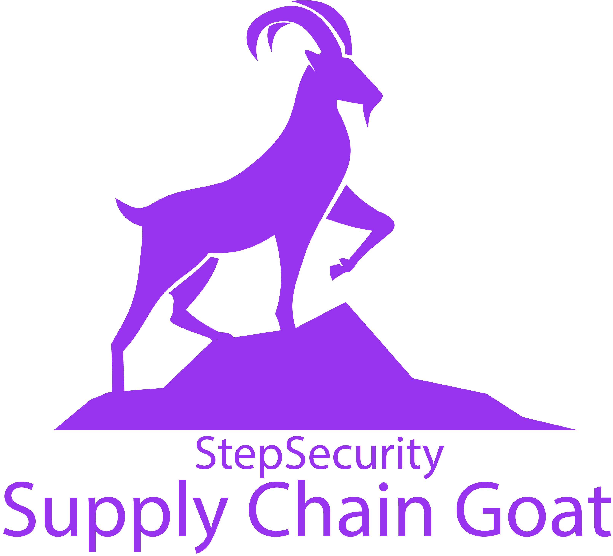

Supply Chain Goat follows the tradition of existing *Goat projects. It provides a training ground to practice implementing countermeasures specific to the software supply chain. 

StepSecurity defines a supply chain attack as an attack that tries to hijack software that you produce or consume. 

Follow these `hands-on tutorials` (each only takes 2-5 minutes) to learn about threats and countermeasures related to the software supply chain. If you would like to see a different threat being addressed, or have other feedback, please create an [issue](https://github.com/step-security/supply-chain-goat/issues) or participate in [discussions](https://github.com/step-security/supply-chain-goat/discussions). 

## Weekly instructor-led session
While you can follow the hands-on tutorials on your own, if you want, you can also attend the free weekly instructor-led session. Each session is limited to 10 attendees. You can register [here](https://calendly.com/varunsh-step/supply-chain-goat).

## Prerequisites

StepSecurity recommends the following prerequisites to be met to get the best out of these tutorials.
* GitHub account
* Basic knowledge of CI/CD pipelines and GitHub Actions

## Threats and Countermeasures

This table lists threats and countermeasures related to software supply chain security. More will be added over time. 

Number | Threats  | Countermeasures  | Related incidents
-------|--------- |------------------|----------------
1      |DNS exfiltration for reconnaissance from build server | `Hands-on Tutorial`: [Prevent DNS Exfiltration from build server](DNSExfiltration.md) | [Dependency confusion](https://medium.com/@alex.birsan/dependency-confusion-4a5d60fec610)
2      |Exfiltration of secrets from the build server | `Hands-on Tutorial`: [Restrict outbound traffic from build server](RestrictOutboundTraffic.md) | [Codecov breach](https://about.codecov.io/security-update/), [event-stream incident](https://blog.npmjs.org/post/180565383195/details-about-the-event-stream-incident.html), [VS Code GitHub Bug Bounty Exploit](https://www.bleepingcomputer.com/news/security/heres-how-a-researcher-broke-into-microsoft-vs-codes-github/)
3      |Exfiltration of `GITHUB_TOKEN` from the build server | `Hands-on Tutorial`: [Set minimum permissions for `GITHUB_TOKEN`](MinimumTokenPermissions.md)| [VS Code GitHub Bug Bounty Exploit](https://www.bleepingcomputer.com/news/security/heres-how-a-researcher-broke-into-microsoft-vs-codes-github/)
4      |Masquerading of tools on build server | `Hands-on Tutorial`: [Cryptographically verify tools run as part of the CI/ CD pipeline](CryptographicallyVerify.md)  | [Solar Winds (SUNSPOT) breach](http://crowdstrike.com/blog/sunspot-malware-technical-analysis/), [Codecov breach](https://about.codecov.io/security-update/)
5      |Modification of source code on build server | `Hands-on Tutorial`: [Monitor source code on build server](MonitorSourceCode.md)  | [Solar Winds (SUNSPOT) breach](http://crowdstrike.com/blog/sunspot-malware-technical-analysis/)
6      |No forensics data about build & release steps | Tutorial: Generate provenance (coming soon)  | [Solar Winds (SUNSPOT) breach](http://crowdstrike.com/blog/sunspot-malware-technical-analysis/), [Codecov breach](https://about.codecov.io/security-update/), [event-stream incident](https://blog.npmjs.org/post/180565383195/details-about-the-event-stream-incident.html)
7      |Compromised dependency | `Hands-on Tutorial`: [Behavioral analysis of dependencies](CompromisedDependency.md)  | [event-stream incident](https://blog.npmjs.org/post/180565383195/details-about-the-event-stream-incident.html), [Embedded malware in ua-parser-js](https://github.com/advisories/GHSA-pjwm-rvh2-c87w)
8      |Typosquatting | Tutorial: Use trustworthy dependencies (coming soon)  | [Malicious python libraries](https://www.zdnet.com/article/two-malicious-python-libraries-removed-from-pypi/), [Typosquatted libraries in Ruby Gems repo](https://thehackernews.com/2020/04/rubygem-typosquatting-malware.html)
9      |Compromised dependency | Tutorial: Quickly find libraries that are using compromised dependency (coming soon)  | [event-stream incident](https://blog.npmjs.org/post/180565383195/details-about-the-event-stream-incident.html), [Embedded malware in ua-parser-js](https://github.com/advisories/GHSA-pjwm-rvh2-c87w)
