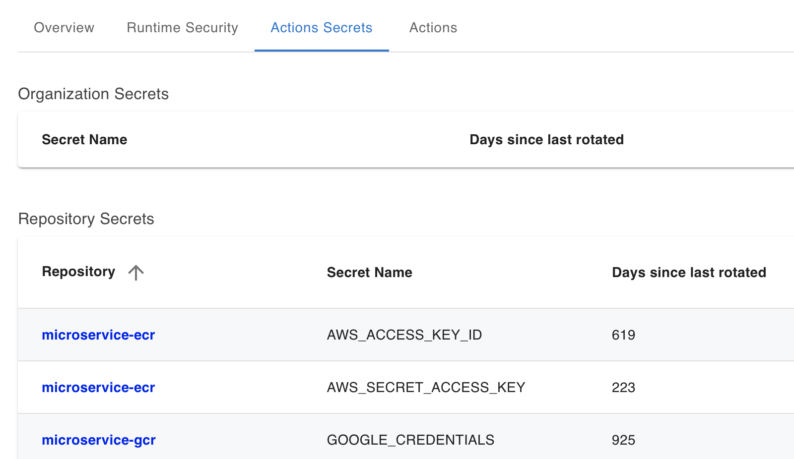

# Audit and Rotate GitHub Actions Secrets

> ["Minimize the use of long-term credentials" in CISA/NSA document](https://media.defense.gov/2023/Jun/28/2003249466/-1/-1/0/CSI_DEFENDING_CI_CD_ENVIRONMENTS.PDF): For software-to-software authentication, avoid using software-based long-term credentials as much as possible.

[🔙 Go back to the list of tutorials](../../README.md#vulnerabilities-and-countermeasures)

## Tutorial

In this tutorial you will use the [StepSecurity Actions Security GitHub App](https://github.com/apps/stepsecurity-actions-security) to view the list of all your GitHub Actions Secret names and `Days Since Last Rotated`. This will help you understsand which secrets should be rotated.

1. Add a GitHub Actions secret to your repository. Under your repository name, click Settings. In the `Security` section of the sidebar, select ` Secrets and variables``, then click  `Actions`` . Click the `Secrets `` tab. Click `New repository secret`` and add a secret. You can add any name and value.

2. Install the [StepSecurity Actions Security GitHub App](https://github.com/apps/stepsecurity-actions-security) on your repository. You will get an email with a link to your dashboard.

3. Then go to the `Actions Secrets` tab in the dashboard. Here you will be able to view the secret name along with `Days Since Last Rotated`. Since this is a new secret, that value will be 0. You can try on your own repository where you had created secrets on an earlier date.

    

> The App only needs `actions: read` and `secrets metadata: read` permissions on your repositories. `secrets metadata: read` permission only gives access to the list of GitHub Actions secret names (and not to the actual secret).
