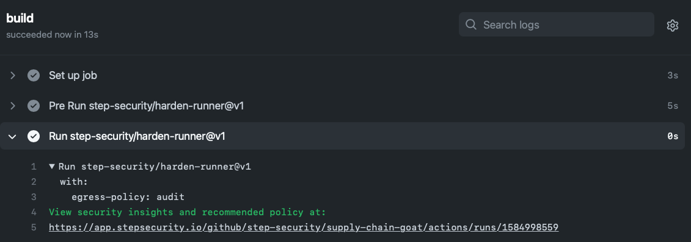
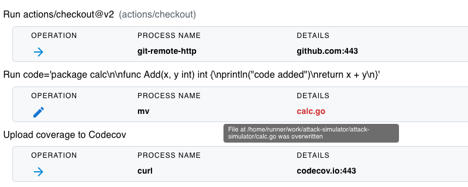

# GitHub Actions Runtime Security - Detect File Tampering

For examples of real-world incidents in which files have been tampered during CI/CD pipelines, refer to [Tampering of source code or artifacts during build](../Vulnerabilities/TamperingDuringBuild.md)

## Tutorials

1. [Detect File Tampering (GitHub-Hosted Runner)](#detect-file-tampering-github-hosted-runner)
2. [Detect File Tampering (Actions Runner Controller)](#detect-file-tampering-actions-runner-controller)

## Detect File Tampering (GitHub-Hosted Runner)

Learn how to detect file modification on the build server in a GitHub Actions workflow.

1. Browse to the [ci.yml](../../.github/workflows/ci.yml) workflow. Add the `step-security/harden-runner` GitHub Action as the first step. After the checkout step, add another step to simulate modification of a source code file, and another to simulate `sudo` call. The updated file should look like this:

   ```yaml
   name: Test and coverage

   on: [push, pull_request, workflow_dispatch]

   jobs:
     build:
       runs-on: ubuntu-latest
       steps:
         - uses: step-security/harden-runner@v2
           with:
             egress-policy: audit
             disable-sudo: true
         - uses: actions/checkout@v2
           with:
             fetch-depth: 2
         - run: | # simulate modification of source code
             code='package calc\n\nfunc Add(x, y int) int {\nprintln("code added")\nreturn x + y\n}'
             printf "$code" > calc1.go
             mv calc1.go calc.go
         - uses: actions/setup-go@v2
           with:
             go-version: "1.17"
         - name: Run coverage
           run: go test -race -coverprofile=coverage.txt -covermode=atomic
         - name: Simulate sudo access
           run: sudo ls
         - name: Upload coverage to Codecov
           run: |
             bash <(curl -s https://codecov.io/bash)
   ```

Commit the changes to `main` branch.

2. The `step-security/harden-runner` GitHub Action installs an agent into the Ubuntu VM that monitors changes to source code. In a typical workflow, source code is checked out from the repository and does not need to be altered. In this case, since it is altered, the change will be detected.

3. This change should cause the workflow to run, as it is set to run on push. Click on the `Actions` tab and then click on the `Test and coverage` workflow run.

4. You should see a link to security insights and recommendations for the workflow run under the `Run step-security/harden-runner` tab.



5. Click on the link. You should see that the file overwrite has been detected.



6. In the Action steps, notice that the `sudo` step failed, since `disable-sudo: true` was set using harden-runner.

7. This shows how [`Harden-Runner`](https://github.com/step-security/harden-runner) prevents malicious steps from calling `sudo` and detects file overwrites during build.

8. You can install the [StepSecurity Actions Security GitHub App](https://github.com/apps/stepsecurity-actions-security) to get notified via email or Slack when a source code file is overwritten in your workflow.

## Detect File Tampering (Actions Runner Controller)

Actions Runner Controller (ARC) is a Kubernetes operator that orchestrates and scales self-hosted runners for GitHub Actions.

1. Rather than incorporating the HardenRunner GitHub Action into each individual workflow, you'll need to install the ARC-Harden-Runner daemonset on your Kubernetes cluster.

2. Upon deployment, the ARC-Harden-Runner daemonset constantly monitors for any modifications to files during your workflows, detecting any unauthorized changes promptly.

3. Install the [StepSecurity Actions Security GitHub App](https://github.com/apps/stepsecurity-actions-security)

4. With the app installed:

- You can access security insights and runtime detections under the `Runtime Security` tab in your dashboard
- You'll receive notifications via email or Slack whenever a file is overwritten in your workflow.

For a demo of a workflow running on ARC with Harden Runner integrated, please refer to following links:

- Workflow file: https://github.com/step-security/github-actions-goat/blob/main/.github/workflows/arc-self-hosted.yml
- Example workflow run: https://github.com/step-security/github-actions-goat/actions/runs/5523945688
- Workflow Insights: https://app.stepsecurity.io/github/step-security/github-actions-goat/actions/runs/5523945688

As demonstrated, detections occur automatically, without the need to add the Harden Runner Action to each workflow.

Even though you do not need to add Harden-Runner Action to detect file modifications in ARC, the insights are exactly the same as with GitHub-hosted runner.
