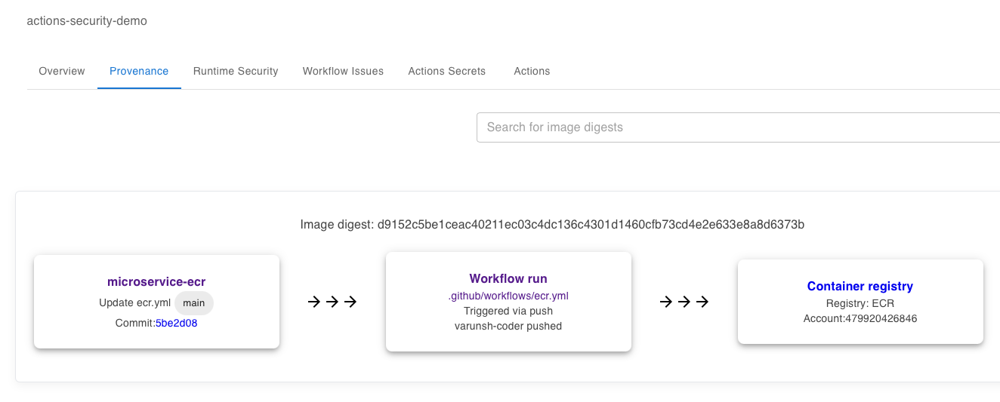

# Trace Deployments to CI/CD Pipeline and Commit

## Tutorial

In this tutorial, you will publish a docker image and then trace the published image back to the GitHub Actions workflow run that pushed it and the commit that triggered the workflow.

1. Go to the `Actions` tab and run the `Publish Docker` workflow. This workflow is setup to publish a docker image to `GitHub Container Registry` in your forked repository.

2. Click on the `StepSecurity Report` link in the markdown

3. You will notice a tab for `Provenance`. Click on that tab. You should see a record for the container image that was published by the workflow.

4. The record shows the image's digest along with the workflow run that published it, and who triggered it etc.

