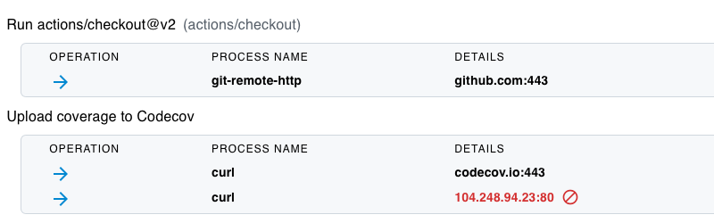

# GitHub Actions Runtime Security - Filter Network Traffic

For examples of real-world incidents in which credentials have been exfiltrated from CI/CD pipelines, refer to [Exfiltration of secrets from the CI/ CD pipeline](../Vulnerabilities/ExfiltratingCICDSecrets.md)

## Tutorial

In this tutorial, you will use the step-security/harden-runner GitHub Action to audit and filter network traffic to prevent credential exfiltration.

1. GitHub Action workflow files are in the `.github/workflows` folder of the repo. Browse to the [ci.yml](../../.github/workflows/ci.yml) file. Edit it using the GitHub website, and add the `step-security/harden-runner` GitHub Action as the first step. Commit the changes to `main` branch.

   ```yaml
   - uses: step-security/harden-runner@v2
     with:
       egress-policy: audit
   ```

   The updated file should look like this:

   ```yaml
   name: Test and coverage

   on: [push, pull_request, workflow_dispatch]

   jobs:
     build:
       runs-on: ubuntu-latest
       steps:
         #Add StepSecurity Harden Runner from here onwards
         - uses: step-security/harden-runner@v2
           with:
             egress-policy: audit
         - uses: actions/checkout@v2
           with:
             fetch-depth: 2
         - uses: actions/setup-go@v2
           with:
             go-version: "1.17"
         - name: Run coverage
           run: go test -race -coverprofile=coverage.txt -covermode=atomic
         - name: Upload coverage to Codecov
           run: |
             bash <(curl -s https://codecov.io/bash)
   ```

2. This change should cause the workflow to run, as it is set to run on push. Click on the `Actions` tab to view the workflow run.

3. You should see a link to security insights and recommendations for the workflow run.


4. Click on the link. You should see outbound traffic correlated with each step of the workflow. An outbound network policy would be recommended.

5. Update the [ci.yml](../../.github/workflows/ci.yml) workflow with the policy. The first step should now look like this. From now on, outbound traffic will be restricted to only these domains for this workflow.

   ```yaml
   - uses: step-security/harden-runner@v2
     with:
       egress-policy: block
       allowed-endpoints: >
         codecov.io:443
         github.com:443
   ```

   The updated file should look like this:

   ```yaml
   name: Test and coverage

   on: [push, pull_request, workflow_dispatch]

   jobs:
     build:
       runs-on: ubuntu-latest
       steps:
         #Add StepSecurity Harden Runner from here onwards
         - uses: step-security/harden-runner@v2
           with:
             egress-policy: block
             allowed-endpoints: >
               codecov.io:443
               github.com:443
         - uses: actions/checkout@v2
           with:
             fetch-depth: 2
         - uses: actions/setup-go@v2
           with:
             go-version: "1.17"
         - name: Run coverage
           run: go test -race -coverprofile=coverage.txt -covermode=atomic
         - name: Upload coverage to Codecov
           run: |
             bash <(curl -s https://codecov.io/bash)
   ```

6. Simulate an exfiltration attack similar to Codecov. Update the workflow and add the following statement. The bash uploader is no longer vulnerable, but when it was, it would have made an additional outbound call, which is being simulated here.

   ```yaml
   - name: Upload coverage to Codecov
     run: |
       bash <(curl -s https://codecov.io/bash)
       curl -X GET http://104.248.94.23
   ```

   The updated file should look like this:

   ```yaml
   name: Test and coverage

   on: [push, pull_request, workflow_dispatch]

   jobs:
     build:
       runs-on: ubuntu-latest
       steps:
         #Add StepSecurity Harden Runner from here onwards
         - uses: step-security/harden-runner@v2
           with:
             egress-policy: block
             allowed-endpoints: >
               codecov.io:443
               github.com:443
         - uses: actions/checkout@v2
           with:
             fetch-depth: 2
         - uses: actions/setup-go@v2
           with:
             go-version: "1.17"
         - name: Run coverage
           run: go test -race -coverprofile=coverage.txt -covermode=atomic
         - name: Upload coverage to Codecov
           run: |
             bash <(curl -s https://codecov.io/bash)
             curl -X GET http://104.248.94.23
   ```

7. This change should cause the workflow to run, as it is set to run on push. Observe that the workflow fails because the call is blocked. Click the link to security insights. You can see that blocked calls are shown in Red color in the insights page.

   

8. Install the [StepSecurity Actions Security GitHub App](https://github.com/apps/stepsecurity-actions-security) to get notified via email or Slack when outbound traffic is blocked.

## Using Harden Runner with ARC (Actions Runner Controller) for Auditing Outbound Traffic

For those utilizing Actions Runner Controller (ARC) in a Kubernetes environment for self-hosted runners, the procedure to integrate Harden Runner varies slightly. Rather than incorporating the Harden Runner step into each individual workflow, you'll need to install the ARC Harden Runner DaemonSet on your Kubernetes cluster.

ARC is a Kubernetes controller for GitHub Actions self-hosted runners and its use allows Harden Runner to automatically integrate across all your existing GitHub Actions workflows without the need to individually modify each one.

During your workflows, the ARC Harden Runner DaemonSet systematically examines the outbound calls made and correlates them with each step of the workflow.

For a demo of a workflow running on a Kubernetes self-hosted runner with Harden Runner integrated, please refer to this [link](#). Here is an [example of a workflow run]() and the associated [workflow run insights](). As demonstrated, auditing of egress traffic occurs automatically, without the need to directly add the Harden Runner Action to the workflow.

Security insights for ARC-based self-hosted runners can be found under the Runtime Security tab in the dashboard at [app.stepsecurity.io](#) (to be updated).

Remember, to utilize Harden Runner with ARC-based self-hosted runners and enforce outbound traffic auditing, it is necessary to install the [StepSecurity Actions Security GitHub App](https://github.com/apps/stepsecurity-actions-security).

It's important to note that while the feature to restrict outbound traffic is not yet available for ARC-based self-hosted runners, it is currently in development and is expected to be released in a few weeks.
