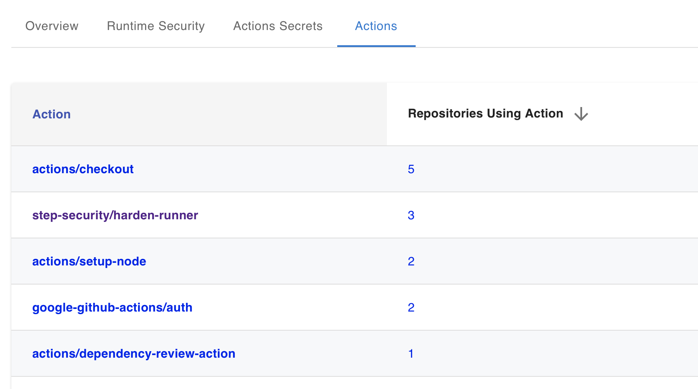

# Review GitHub Actions Across your Organization

> **["Restrict untrusted libraries and tools" section in CISA/NSA document](https://media.defense.gov/2023/Jun/28/2003249466/-1/-1/0/CSI_DEFENDING_CI_CD_ENVIRONMENTS.PDF)**: Only use software, tools, libraries, and artifacts from secure and trusted sources. Employing software from a trusted source helps minimize the threats posed to the CI/CD pipeline and prevent potential exploitation (i.e., code execution and backdoors) by MCAs

[🔙 Go back to the list of tutorials](../../README.md#vulnerabilities-and-countermeasures)

## Tutorial

In this tutorial you will use the [StepSecurity Actions Security GitHub App](https://github.com/apps/stepsecurity-actions-security) to view the list of all GitHub Actions used across your organization.

1. Install the [StepSecurity Actions Security GitHub App](https://github.com/apps/stepsecurity-actions-security) on your repository or a list of repositories in your organization. You will get an email with a link to your dashboard.

2. In the dashboard, go to the `Actions` tab. Here you will be able to view the list of all GitHub Actions being used in your organization and the number of repositories each is being used in.

3. You can now click on the `Repositories using Action` link next to an Action to view the list of all the repositories in which that Action is being used.

   

4. You can click on the GitHub Action name to go to the GitHub Action's repository.
