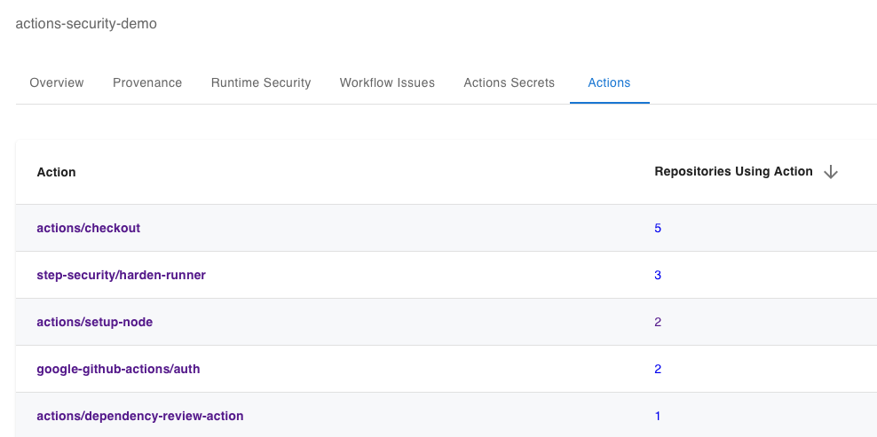

# Review GitHub Actions Across your Organization

## Tutorial

In this tutorial you will use the [StepSecurity Actions Security GitHub App](https://github.com/apps/stepsecurity-actions-security) to view the list of all GitHub Actions used across your organization.

1. Install the [StepSecurity Actions Security GitHub App](https://github.com/apps/stepsecurity-actions-security) on your repository or a list of repositories in your organization. You will get an email with a link to your dashboard.

2. In the dashboard, go to the `Actions` tab. Here you will be able to view the list of all GitHub Actions being used in your organization and the number of repositories each is being used in.

3. You can now click on the repositories link next to an Action to view the list of all the repositories in which that Action is being used.

