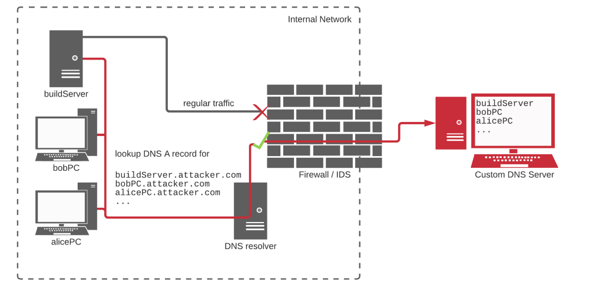

# Exfiltration of secrets from the CI/ CD pipeline

GitHub Actions workflows can be poisoned, potentially leading to the exfiltration of CI/CD secrets. This can occur in various ways, such as:

1. **Direct Workflow Alteration:** An attacker can directly modify the workflow, introducing code that uses HTTP requests to send secrets or other repository data to an external server.
2. **Utilizing Malicious or Vulnerable Dependencies:** An attacker might exploit a GitHub Action or any other dependency incorporated in the workflow that has been tampered with or is inherently vulnerable. This could subsequently expose your secrets.
3. **Code Execution During Workflow Run:** A scenario can occur where code with harmful intent gets executed during a workflow run. This could be instigated through a seemingly innocuous component such as a test case. Such code can be designed to extract and expose confidential data.
4. **Build Server Compromise:** An attacker might attempt to breach the security of the build server on which the GitHub Actions workflow runs.

## Summary of past incidents

Here are some examples of past incidents where CI/CD pipelines were poisoned to exfiltrate CI/CD Secrets.

### Codecov breach

In early 2021, [secrets were exfiltrated](https://about.codecov.io/security-update/) from thousands of build servers, when a popular component used in build pipelines by enterprises, startups, and open source projects - Codecov bash uploader - was modified by adversaries. None of the victims detected that secrets were being exfiltrated to two IP addresses from their build servers for 2 months.

### VS Code GitHub Actions Exploit

In December 2020, [ryotkak](https://twitter.com/ryotkak) reported as part of the Bug Bounty program how he exfiltrated the `GITHUB_TOKEN` from a GitHub Actions workflow. You can read the details [here](https://www.bleepingcomputer.com/news/security/heres-how-a-researcher-broke-into-microsoft-vs-codes-github/?&web_view=true) and [here](https://blog.ryotak.me/post/vscode-write-access/).

### Dependency confusion attacks

In Feb 2021, Alex Birsan wrote about dependency confusion attacks, and how DNS exfiltration was used to collect information about different build servers, before launching a more specific attack.

> Knowing that most of the possible targets would be deep inside well-protected corporate networks, I considered that **DNS exfiltration** was the way to go - Alex Birsan

This is a common theme where an attacker gets specific information about where their code is executing before tailoring their attack. This image is taken from the [dependency confusion attack blog post](https://medium.com/@alex.birsan/dependency-confusion-4a5d60fec610) and explains how DNS exfiltration works. Specific information (could be a secret) is set as a sub-domain to the attacker controlled domain, and the build server is asked to resolve the IP address for the sub-domain. Such DNS traffic is rarely filtered leading to a higher success rate.

  

### Compromised dependencies

There have been multiple attacks that can be attributed to compromised dependencies. The general theme is that a widely used dependency is hijacked and code is pushed into the dependency that makes malicious outbound calls. Such an attack can affect every system that uses that particular dependency. Below is a list of some such attacks that have taken place in the recent past.

| Number | Incident                                                                                                                                                           | Details                                                                                                                                                                                                                                                                                                                                                                                                                                                                                                                                                                                                                                                                                               |
| ------ | ------------------------------------------------------------------------------------------------------------------------------------------------------------------ | ----------------------------------------------------------------------------------------------------------------------------------------------------------------------------------------------------------------------------------------------------------------------------------------------------------------------------------------------------------------------------------------------------------------------------------------------------------------------------------------------------------------------------------------------------------------------------------------------------------------------------------------------------------------------------------------------------- |
| 1      | [Compromise of NPM packages coa and rc](https://blog.sonatype.com/npm-hijackers-at-it-again-popular-coa-and-rc-open-source-libraries-taken-over-to-spread-malware) | A preinstall step `"preinstall": "start /B node compile.js & node compile.js"` was added to the updated dependency. The js files launch a batch script. The batch script then makes calls to https://pastorcryptograph.at using curl and wget                                                                                                                                                                                                                                                                                                                                                                                                                                                         |
| 2      | [Compromise of ua-parser-js](https://github.com/faisalman/ua-parser-js/issues/536)                                                                                 | A preinstall step `"preinstall": "start /B node preinstall.js & node preinstall.js"` was added to the updated dependency. The js files launch a batch script. The preinstall.js then launches OS specific script i.e .bat or .sh, those scripts then uses certutil.exe and wget or curl to download file from: http://159.148.186.228/download/jsextension.exe or https://citationsherbe.at/sdd.dll. Checkout: https://my.diffend.io/npm/ua-parser-js/0.7.28/0.7.29                                                                                                                                                                                                                                   |
| 3      | [The klow / klown / okhsa incident](https://github.com/cncf/tag-security/blob/main/supply-chain-security/compromises/2021/klow-klown-okhsa.md)                     | A preinstall step `"preinstall": "start /B node preinstall.js & node preinstall.js"` was added to the updated dependency. The js files launch a batch script or a shell script acc. to the OS. The batch script then makes a call to http://185.173.36.219/download/jsextension.exe using curl, wget or certutil to download a exe or an elf binary file acc. to the OS. Checkout:https://my.diffend.io/npm/klown/0.7.29                                                                                                                                                                                                                                                                              |
| 4      | [NPM reverse shells and data mining](https://github.com/cncf/tag-security/blob/main/supply-chain-security/compromises/2020/nodejs.md)                              | npm packages (plutov-slack-client, nodetest1010, and nodetest199) execute js script to spawn a child process according to the OS (Windows and Unix-based systems). This child process establishes a reverse shell to the attacker's server using `net.connect`. npm package npmpubman executes a js file to collect info about the victim. It collects user data from the environment info provided by NodeJS “process.env”. This data is posted to a remote host(\*.net) using `http.request`. Checkout: https://www.bleepingcomputer.com/news/security/npm-nukes-nodejs-malware-opening-windows-linux-reverse-shells/                                                                               |
| 5      | [hardhat-waffle](https://medium.com/metamask/how-metamasks-latest-security-tool-could-protect-smart-contract-developers-from-theft-e12da346aa53)                   | The attacker used typo squatting method to attack the targets. Attacker registered a package name similar to a legitimate package. Legitimate Package: `@nomiclabs/hardhat-waffle` and Malicious Package: `hardhat-waffle`. So, if a target developer by mistake used wrong name while installing that package, vulnerable code would get imported. Upon installation, the package would run a `postinstall` script that uploaded the contents of package.json, /etc/hosts, /etc/passwd and Kubernetes credential files (~/.kube/config) to a remote server. Checkout: https://medium.com/metamask/how-metamasks-latest-security-tool-could-protect-smart-contract-developers-from-theft-e12da346aa53 |
